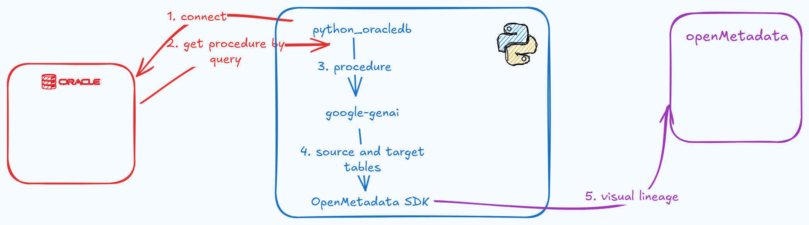

# CREATE LINEAGE FROM PROCEDURE FOR OpenMetadata

OpenMetadata (OM/OMD) is a opensource platform for data governance, collaboration. OM has many functions, one of them is data lineage.
But OM's data lineage use sqllineage lib to parse queries, and that lib can't parse DDL queries which used in many scenarios, typically procedure. 
This script initial from the idea use genAI instead of  the tranditional library.

1. First of all, we connect to oracle at [connect_oracle.py](connect_oracle.py) file.
2. Main jobs excuse at [get_table_by_gemini.py](get_table_by_gemini.py) file
3. after all, you push lineage through OM SDK at [create_lineage](create_lineage.py) file